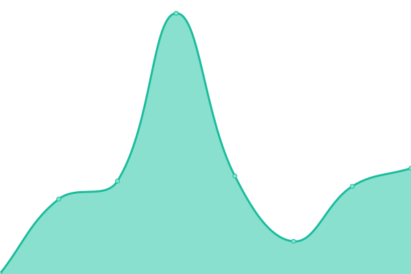
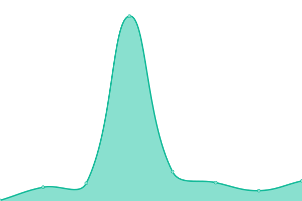

# [📈 Live Status](https://demo.upptime.js.org): <!--live status--> **🟩 All systems operational**

This repository contains the open-source uptime monitor and status page for [UnstoppableSwap](https://demo.upptime.js.org), powered by [Upptime](https://github.com/upptime/upptime).

With [Upptime](https://upptime.js.org), you can get your own unlimited and free uptime monitor and status page, powered entirely by a GitHub repository. We use [Issues](https://github.com/UnstoppableSwap/status/issues) as incident reports, [Actions](https://github.com/UnstoppableSwap/status/actions) as uptime monitors, and [Pages](https://demo.upptime.js.org) for the status page.

<!--start: status pages-->
<!-- This summary is generated by Upptime (https://github.com/upptime/upptime) -->
<!-- Do not edit this manually, your changes will be overwritten -->
<!-- prettier-ignore -->
| URL | Status | History | Response Time | Uptime |
| --- | ------ | ------- | ------------- | ------ |
|  [Download Site](https://unstoppableswap.net/) | 🟩 Up | [download-site.yml](https://github.com/UnstoppableSwap/status/commits/HEAD/history/download-site.yml) | 

 465ms
     
 | 

<a href="https://status.unstoppableswap.net/history/download-site">100.00%</a>
    

|  [Documentation Site](https://unstoppableswap.net/) | 🟩 Up | [documentation-site.yml](https://github.com/UnstoppableSwap/status/commits/HEAD/history/documentation-site.yml) | 

 115ms
     
 | 

<a href="https://status.unstoppableswap.net/history/documentation-site">100.00%</a>
    

|  [Public Registry API](https://api.unstoppableswap.net/api/list) | 🟩 Up | [public-registry-api.yml](https://github.com/UnstoppableSwap/status/commits/HEAD/history/public-registry-api.yml) | 

 7436ms
     
 | 

<a href="https://status.unstoppableswap.net/history/public-registry-api">96.87%</a>
    

|  [Public Rendezvous Point](discover.unstoppableswap.net) | 🟩 Up | [public-rendezvous-point.yml](https://github.com/UnstoppableSwap/status/commits/HEAD/history/public-rendezvous-point.yml) | 

 99ms
     
 | 

<a href="https://status.unstoppableswap.net/history/public-rendezvous-point">100.00%</a>
    

<!--end: status pages-->

[**Visit our status website →**](https://demo.upptime.js.org)

## 📄 License

- Powered by: [Upptime](https://github.com/upptime/upptime)
- Code: [MIT](./LICENSE) © [Anand Chowdhary](https://anandchowdhary.com), supported by [Pabio](https://pabio.com)
- Data in the `./history` directory: [Open Database License](https://opendatacommons.org/licenses/odbl/1-0/)
